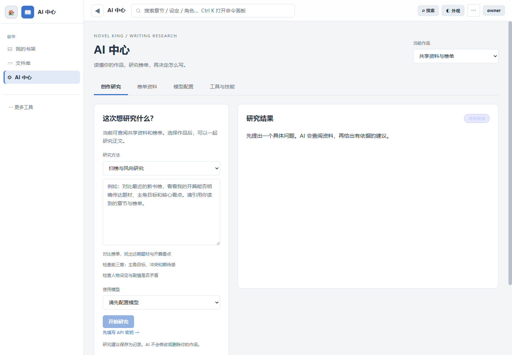
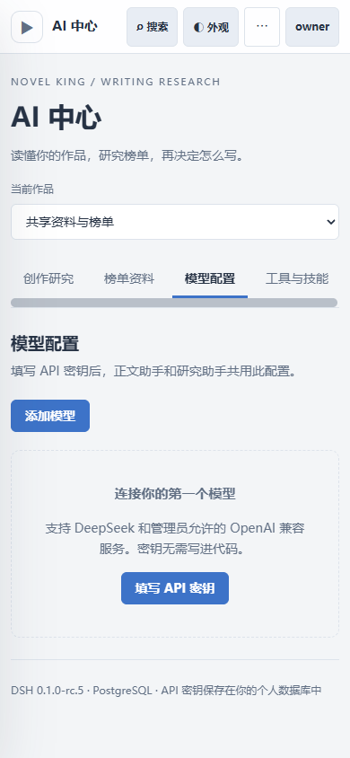
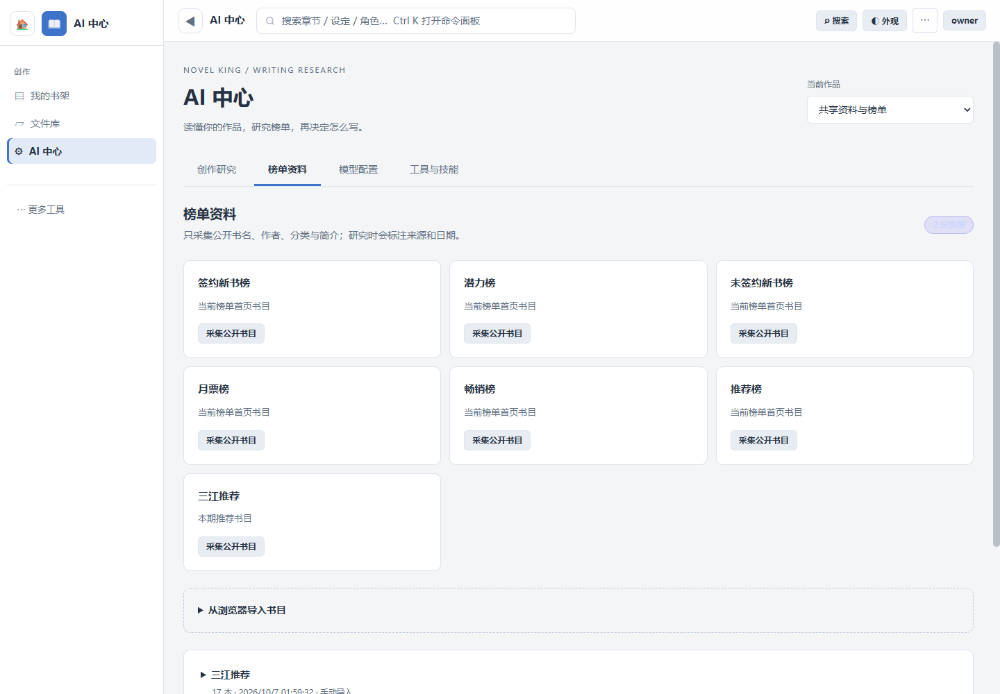

# AI 研究与 PostgreSQL 验收（2026-10-07）

所有模型测试使用隔离目录与受控 HTTP 模型；没有使用作者真实密钥，没有付费 LLM 调用。旧 `data` 和 `accounts-data` 未移动，Docker 查看实例是独立数据，不代表已迁走作者的历史作品。

## 自动化检查

| 检查 | 实际结果 |
| --- | --- |
| `node scripts/ci-offline-checks.mjs` | 最终 60/60 组通过；包含 DSH 研究、原有文件库、画布、账户、上下文与历史状态检查 |
| `node --test scripts/test-postgres-database.mjs scripts/test-postgres-host.mjs` | PostgreSQL 实库 7/7：CRUD、事务、词法索引、中文全文与英文名称搜索、schema 隔离、迁移内容与序列、自引用目录、双精度、全应用迁移、账号隔离、管理员重置 |
| `node scripts/ci-isolated-run.mjs --port 3738 -- node api-test-suite.mjs` | 191 通过、0 失败、4 明确跳过；跳过项是不能在隔离目录还原的全局配置写入，不计为通过 |
| 隔离实例运行 `harness-plugins/novel-writing/test/smoke.mjs` | 39 组断言通过 |
| Linux Docker Node 22.15.0 下 DSH、MCP 作品范围、前端研究选择/流式解析测试 | 8/8；验证打包运行时可在原 Node 下限运行，未宣称整个 Linux 旧测试套件已预演 |
| 改动的 JS/MJS `node --check` | 37 个文件，0 语法错误；项目无独立 lint/typecheck 配置 |
| DSH runtime 指纹与许可证 | SHA256 一致，打包依赖许可证文件存在，没有引入上游 Git |

DSH 测试实际请求本机 SSE 模型，产生工具调用，由 MCP 读取章节后再向模型提供结果；检查取消、重定向拒绝、密钥反射脱敏、兼容服务参数、温度传递、持久化，以及两个请求同时读 body 时只能启动一个任务。HTTP 测试验证跨作品 ID 被拒绝、Agent 不能管理配置、榜单与历史记录可读。

全库迁移用真实程序生成 SQLite，其中包含小说、API 密钥、小数温度、嵌套目录、资料原件与榜单，再启动同一程序的 PostgreSQL 模式，核对内容和原 SQLite 字节不变。个人 schema 为应用隔离，不是数据库角色级别的独立授权。

## Docker 与真实浏览器

独立栈 `novelking-ai-preview` 包含账户应用、PostgreSQL/pgvector、Chromium 榜单服务；应用地址 `http://127.0.0.1:3742`。数据库与榜单浏览器不暴露宿主端口，应用只绑定回环地址。密码和令牌在本机临时 env 中，未写入仓库或此文档。

通过 browser-harness 连接单独测试标签页，完成登录、模型配置保存、重建应用容器后配置仍可见、MCP 工具发现/勾选/启用。验收用虚拟 API 配置随后删除，等待用户填写实际密钥；Exa 搜索/阅读两个工具已启用。未关闭用户其他浏览器或 Docker 项目。

1440×1000 桌面和 390×844 手机截图；手机侧栏关闭后模型入口、作品选择及四个页面都可操作，页面宽度等于视口，没有横向溢出。手机页签可以水平滚动。

## 外部来源核验

- Exa 公共 Streamable HTTP MCP 实际完成 initialize、tools/list 和搜索调用，发现 `web_search_exa`、`web_fetch_exa` 只读工具。搜索结果本身不能当作起点官方市场数据。
- 真实浏览器公开新书榜页识别 20 本，三江识别 17 本。三江页面的日期为 **2026.09.27–2026.10.04**，保留这一期，不将它称为当天更新。
- 两份公开网页书目已作为**手动导入**保存到查看实例，带原始来源、采集时间；没有声称是后台自动采集成功。
- Docker 中实际调用自动采集返回 **422**，未识别到有效条目，因此没有保存第三份空快照。新的普通无头浏览器也遇到起点验证。提供人工导入，不尝试绕过验证。
- 没有爬付费正文，也没有编造热度、趋势结论或拒稿原因。

## 仍需分清的限制

实际付费服务商连接需用户填入 API 密钥后测试；当前并未产生真实模型研究结论。pgvector 扩展已启用，embedding 与语义检索尚未实现。服务器数据库和备份中 API 密钥目前为明文。

官方 npm registry 的 `npm audit --omit=dev --json` 显示 **17 项（6 high、9 moderate、2 low）**，来自已有 Excalidraw/Mermaid、Mammoth 等依赖链。不能称为无依赖告警；没有执行会强制降级画布和 Word 导入的 `npm audit fix --force`。后续应升级或替换受影响链并复测画布、导入；本次不把这些历史告警宣称为已修复。

一轮在同时重建 Docker 和进行运行时验收时，文件库测试组非零退出；随后独立 11/11、最终整套 60/60 通过。原清单只输出失败摘要，未保留首次完整断言，不能据此宣称已定位或修复一个文件库缺陷。
